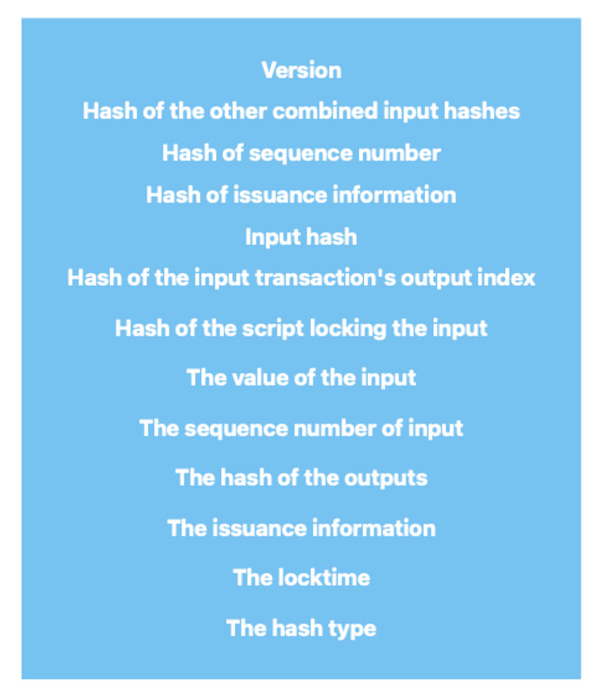

# Making covenants with CHECKSIGFROMSTACK

Here’s a short post about CHECKSIGFROMSTACK covenants that I’ve been sitting on for a while. I wrote it last year and have example code of how to construct these types of covenants here:
https://github.com/Randy808/liquid-checksigfromstack-example

In the covenant construction process there are two main roles: the covenant builder and the covenant spender. The covenant builder is responsible for creating the covenant script and address, and for funding the covenant by sending Bitcoin to that address. The covenant spender is responsible for providing the data in the spending script that will satisfy the conditions in the covenant's locking script, allowing the Bitcoin to be spent.

CHECKSIGFROMSTACK is an opcode that takes in 3 pieces of data from the stack (listed from top to bottom) -- a message, a public key, and a signature. CHECKSIGFROMSTACK then hashes the message with sha256 and uses the public key on the stack to verify the signature against the hashed message. This helps ensure the authenticity of the message.

To construct covenants as a covenant builder using CHECKSIGFROMSTACK, you need to create a locking script that includes the data you’d want to restrict in the transaction that spends it. As previously mentioned in our potential use case, this might include a condition that the destination address in the transaction must be a specific address, or that additional inputs must be provided in order to spend the Bitcoin.

The first thing that must be added to the locking script for a CHECKSIGFROMSTACK covenant is a public key and a CHECKSIG operation. This will ensure that the party spending from the covenant is authorized to do so by requiring a signature from the public key listed. This signature should be duplicated for future use in our covenant. After that you need to add a CHECKSIGFROMSTACK operation that will validate the transaction that spends from the covenant. CHECKSIGFROMSTACK does this by using the public key on the stack to verify that the hash of the transaction data matches the duplicated signature validated by the CHECKSIG and provided by the covenant spender.

The fields of a transaction that can be constrained can be viewed in figure 2. These are the fields that need to be signed to spend an asset on Liquid. The option to restrict certain fields can vary depending on the hash type chosen for the signature provided to the covenant. For example, the ‘hash of the other combined input hashes’ can be a hash of empty data if the ‘anyonecanpay’ flag is noted in the hash type. The number of hashed outputs can also differ depending on which one of the ‘sighash_all’ or ‘sighash_single’ flags are chosen.

To illustrate this process, let's consider a simple example of a covenant that restricts the destination address in a transaction. As the covenant builder you would create a locking script that includes an output of a Bitcoin transaction as it would appear in the serialized transaction by the covenant spender. You would also include the Script commands that will take the rest of the transaction data (to be provided by the covenant spender) and combine it with the fixed data in the locking script to create the full locking script expression. You would then add the CHECKSIG and CHECKSIGFROMSTACK operations as described above.

Using CHECKSIG and CHECKSIGFROMSTACK as a way to enact transaction constraints achieves the goal of:

1. Being able to verify that the covenant spender’s provided signature attests to the the information held within the transaction (achieved via checksig)

2. Using that same signature as a reference to compare with transaction data built on the stack (via CHECKSIGFROMSTACK)

To fulfill the covenant's spending condition, the additional transaction data not contained by the CHECKSIGFROMSTACK covenant, and the transaction signature, must all be provided in the transaction built by the covenant spender. The script will then reconstruct the transaction data, check the signature provided by the covenant spender against the CHECKSIG opcode (to make sure the data is bound to the transaction), and check the signature that was run through the CHECKSIG opcode by passing it to CHECKSIGFROMSTACK along with the public key and reconstructed transaction data.
